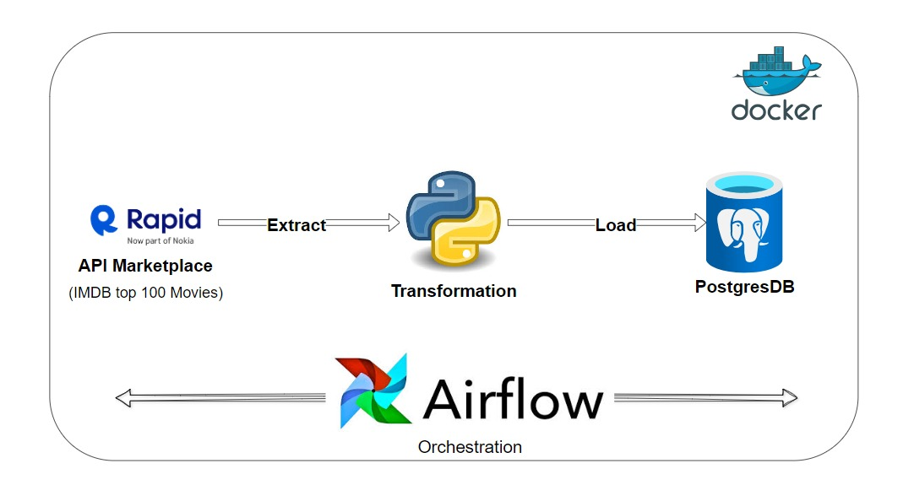

# Airflow ETL: Fetch, Transform, and Load IMDb Data

This project demonstrates how to build a robust ETL pipeline using Apache Airflow. The pipeline extracts IMDb's top movie data from an API, transforms the data for analysis, and loads it into a PostgreSQL relational database. The entire application is containerized using Docker for easy deployment and scalability.

## 📜 Pipeline Workflow  
### 1. Extract  
- Fetch movie data (title, rank, rating, etc.) using the [IMDb API](https://rapidapi.com/rapihub-rapihub-default/api/imdb-top-100-movies) via RapidAPI.  

### 2. Transform  
- Filter movies with ratings greater than 8.5.  
- Classify movies by era: "Classic" (before 2000) or "Modern" (2000 and later).  

### 3. Load  
- Insert the processed data into a PostgreSQL database.  

### 4. Automation  
- Schedule the pipeline to run daily using Apache Airflow.  

---

## 🛠️ Tech Stack  
- **Orchestration**: Apache Airflow  
- **Programming Language**: Python  
- **Database**: PostgreSQL  
- **APIs**: IMDb API (via [RapidAPI](https://rapidapi.com))  
- **Data Transformation**: Pandas  
- **Containerization**: Docker  

---

## 🚀 Setup Instructions  
To get started with the project, follow the detailed instructions in the [Setup Guide](setup.md). 

## 🎯 Usage
 - Access the Airflow UI at http://localhost:8080
 - Trigger the DAG manually or let it run on the schedule.

## 🔮 Future Enhancements
 - Add data quality checks during the transformation stage.
 - Integrate with a data visualization tool for real-time analytics.
 - Add monitoring to track pipeline performance.

## 🤝 Contributing
 - Contributions are welcome! Feel free to submit issues or pull requests for bug fixes and new features.

## Screenshots
OutPut: 

